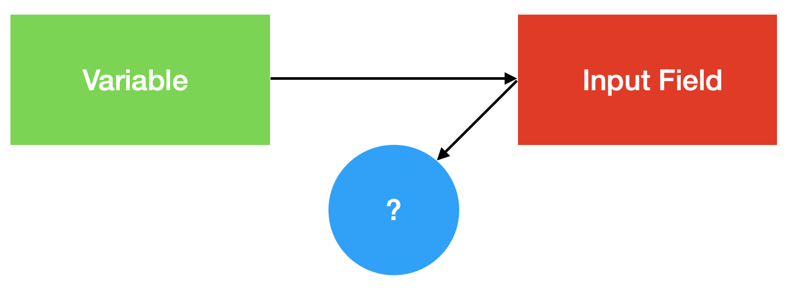

# Vue Presentation Layer, part 1: introduction

Introducing Vue and its basic concepts, like one-way data binding, reactive data and templating engine.

---

# Summary

- Introduction
- Data binding
- Styling
- Templating

---

# Data binding

Given an input field binded to a variable...

### 2-way

- **every change** in the variable is reflected in the input
- **every change** in the input is reflected in the variable

### 1-way

- **every change** in the variable is reflected in the input
- **no change** in the input is reflected in the variable

---

## 2-way data binding

- tipical for desktop application
- implemented in Angular 1.x
- absorb the "burden of update"
    - *technical solution*
- if misused might lead to catastrophic results
    - messy data management
    - performance disruption

### ...but

- vue allows 2-way data binding (`v-model` directive), but only in specific contexts

--- 

---

## 1-way data binding

- commonly used in web applications
- implemented in React and Vue
- delegates the "burden of update" to the developer
    - *architectural solution*

### Vue...

- implements something called *reactive data*
    - objects or arrays
    - "leave a trace" when changing
    - you can "track" the change and **react to it by performing an action**

--- 

---

## 1-way data binding

- Vue implements something called *reactive data*
    - objects or arrays
    - "leave a trace" when changing
    - you can "track" the change and **react to it by performing an action**

--- 

# Code time

**Pro tip**: take notes here...

### References

- [Reactive data](https://vuejs.org/v2/guide/reactivity.html)
- [One way data flow](https://vuejs.org/v2/guide/components-props.html)

---

# Woh, woh, woh... Hang on dude! 

What the...? What are these things?

---

# SFC (Single File Component)

### `<template>`

- contains the "html-ish" code
- always needs 1 html element as single root

### `<style>`

- contains the styles

### `<script>`

- contains javascript (or typescript) behavioural implementation

---

# Q&A
